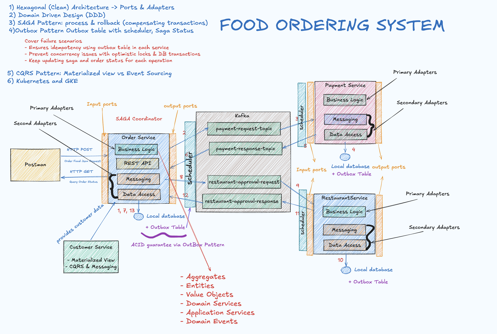
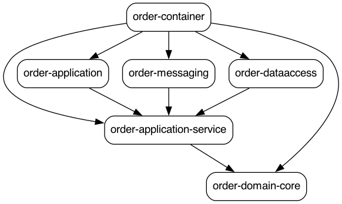
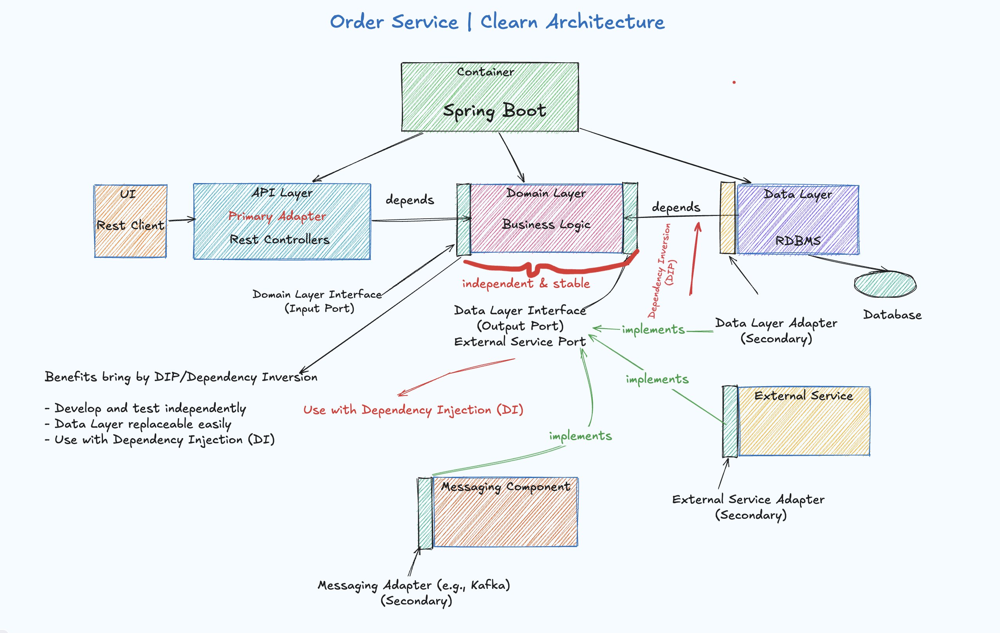
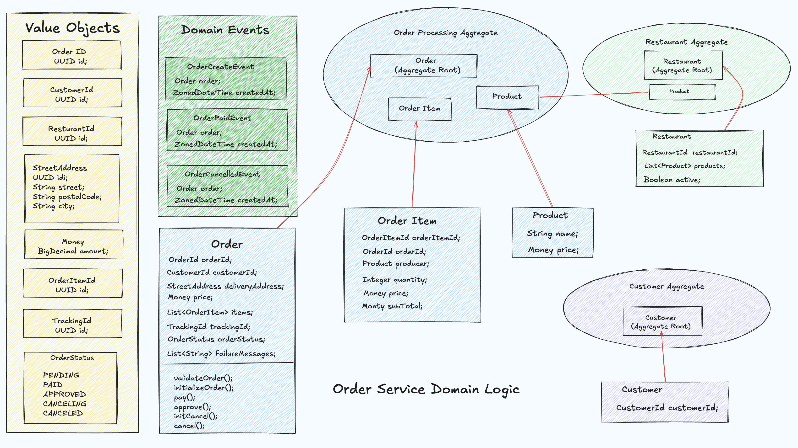

# Event-Driven Architecture in Action 
This repository demonstrates **Event-Driven Architecture (EDA)** from a learner's perspective, using a **Food Ordering System** as the core example. 
It focuses on breaking down real-world distributed system patterns into practical, observable components. 

## Architecture Diagram 

## Module Dependencies 

## Overview 
- Core Focus: EDA design principles and production-grade patterns
- Demo Domain: Food Ordering System 
- Architecture Style: Microservices + DDD + Hexagonal Architecture 
- Messaging Backbone: Kafka 
- Deployment: Kubernetes (GKE-ready)

## System Design 
### Services 
#### Order Service 
- 
- Order Service Clean Architecture 

- Order Domain Model Defintion  

- Acts as the Saga Orchestrator 
- Manages order lifecycle and saga state transitions 

#### Customer Service 
- Provides materialized views (CQRS read model)

#### Payment Service & Restaurant Service 
- Consume domain event via Kafka 
- Participate in Saga transactions 

## Architecture Pattern 
### Hexagonal (Clean) Architecture
Eachservice follows **Ports** & **Adapters**
- Primary Adapters: Business logic (application/ domain layer)
- Secondary Adapters:
> Messaging (Kafka producers/consumers)
> Data access (DB interaction)

### Domain-Driven Design (DDD)
- Services are modeled around bounded contexts 
- Clear separation of domain logic and infrastructure 
- Aggregates enforce consistency boundaries 

### Saga Pattern 
- Handles distributed transactions 
- Supports:
> Forward processing 
> Compensating transactions (rollback)

- Order Service tracks and updates
> Saga status 
> Order status at each step 

### Outbox Pattern 
- Each service maintains an Outbox Table 
- Ensures reliable message delivery via:
> ACID DB transactions 
> Idempotency message processing 

- A scheduler/poller publishes events to Kafka 
- Guarantees eventual consistency across services

### CQRS Pattern 
- Separates write model and read model 
- Read side uses: Materialized Views (implemented)
- Compared with: Event Sourcing (conceptual contrast)

### Kubernetes & GKE 
- Services are **independently deployable**
- Designed for
> Scalability 
> Fault isolation 
> Observability (monitoring-ready)

## Reliability & Failure Handling 
Our failure scenraioscovered
- Service crashes during Saga execution 
- Message delivery failures (Kafka)
- Partial transaction completion 
- Duplicate event processing 

Guarantees
- Idempotency: Enforced via Outbox patterns and message handling 
- Concurrency: 
> Optimistic locking 
> Database transactions 

- Consistency
- Saga state + Order state continuously updated
- Eventual consistency across services 

## Key Design Trade-Offs 
- Eventual Consistency vs Strong Consistency 
- Complexity vs Scalability 
- Operational overhead (Kafka, schedulers, Saga state) vs system resilience. 

## Goals 
- Provides a hands-on EDA learning reference 
- Demonstrate how patterns like Saga, Outbox, CQRS, DDD work together
- Show how to build production-ready distributed systems 

## References
- [Food Ordering Syste](https://github.com/agelenler/food-ordering-system)
- [Event-Driven-Microservices-Advanced](https://github.com/Armando1514/Event-Driven-Microservices-Advanced)

